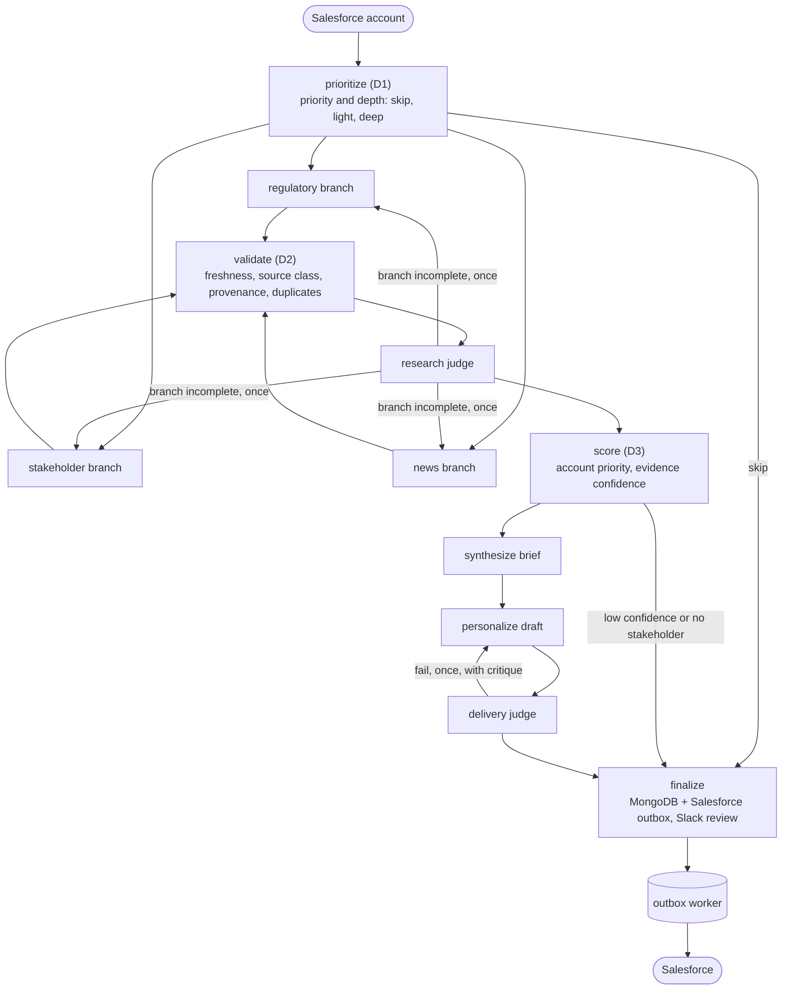

# Account Research Agent

An AI agent that researches a target account for Quorum's Sales Development team and drafts a grounded first-touch email. It finds the account's legislative and regulatory focus, its government affairs stakeholders, and its recent advocacy news. Then it writes the brief and the draft back to Salesforce for an SDR to review.

This repository is the code for Part 2 of the AI GTM Systems Specialist technical assessment. The architecture (Part 1) and the production-readiness answers (Part 3) are in the submission document.

## What the code shows

| Assessment item | Where |
|---|---|
| Main agent orchestrator: reasoning loop, error handling, retries | [`orchestrator.py`](account_research_agent/orchestrator.py), [`nodes.py`](account_research_agent/nodes.py), [`llm.py`](account_research_agent/llm.py), [`rules.py`](account_research_agent/rules.py) |
| Personalization prompt template: context injection, few-shot examples | [`prompts.py`](account_research_agent/prompts.py) |
| Salesforce integration: field mapping, transformation, failed CRM updates | [`salesforce_sync.py`](account_research_agent/salesforce_sync.py) |
| Typed contracts and external interfaces | [`schemas.py`](account_research_agent/schemas.py), [`ports.py`](account_research_agent/ports.py) |

## How a run works



- **Code decides control flow; the model decides content.** Depth, verification, scores, retries and stopping are deterministic. Every loop is bounded by a counter in state.
- **Raw tool output never reaches a prompt.** Each branch turns documents into typed claims. A claim whose excerpt is not a verbatim quote of the fetched source is rejected before any judge sees it.
- **Every draft cites its evidence.** The prompt requires claim ids and knowledge-base ids. A citation to an id that is not in the context fails without a judge call.
- **A judge never grades its own model family.** If the writer fell back to another provider, the judge switches too.
- **Salesforce is written through an outbox.** A CRM outage delays the write and never loses research.

## Run it

Requires Python 3.11+.

```bash
python -m venv .venv
source .venv/bin/activate
pip install -e ".[dev]"
pytest
ruff check .
mypy
```

The tests run the whole graph with in-memory fakes, so no API key is needed.

## What is pseudocode

Calls that need credentials are pseudocode comments behind typed interfaces, so wiring the real service does not change the orchestration:

| Interface | Production implementation |
|---|---|
| `LLMGateway` | `OpenRouterGateway`: OpenRouter chat completions with JSON-schema output |
| `ResearchTools` | `LiveResearchTools`: LDA.gov, Congress.gov, Federal Register, SEC EDGAR, Salesforce, ZoomInfo, Brave Search |
| `SalesforceClient` | `HttpSalesforceClient`: OAuth 2.0 JWT bearer flow and the Composite API |
| `RunRepository`, `OutboxStore` | MongoDB Atlas, with the result and its outbox entry written in one transaction |
| `KnowledgeBase` | Chroma Cloud, approved documents only |
| `ReviewChannel` | Slack app with approve, edit, reject and rerun actions |
| Checkpointer | `MongoDBSaver` from `langgraph-checkpoint-mongodb` (tests use `InMemorySaver`) |

## Tests

45 tests cover the expected path, an edge case and a failure for each feature, including:

- fabricated evidence is rejected, and the branch is re-researched once
- a transient tool error is retried; a permanent one is recorded and the run continues
- two failing drafts reach the SDR flagged as low quality
- draft-only and one-branch reruns reuse the parent run's checkpoint; a fourth rerun in a day is refused
- injected text cannot close a prompt tag, and the few-shot examples obey the prompt's own rules
- Salesforce row locks back off, expired tokens refresh once, validation errors dead-letter with an alert, and an older run cannot overwrite a newer one

## License

MIT
